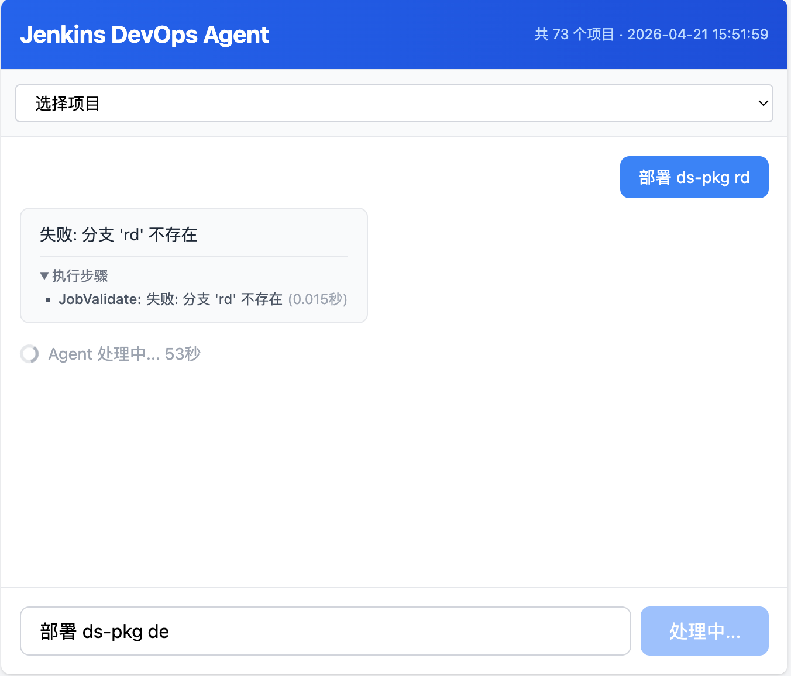
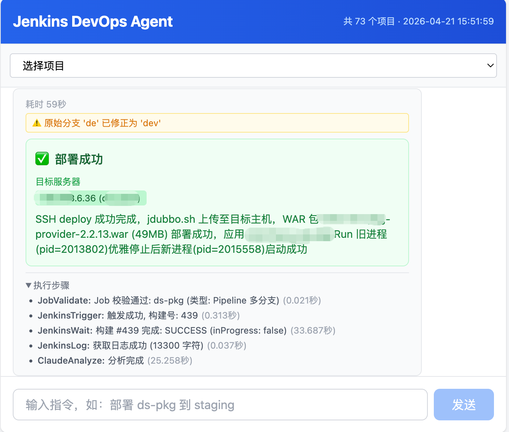

## 架构

### 后端模块

```
backend/src/
├── main.rs              # Axum Web 服务入口
├── lib.rs               # 库入口
├── config.rs            # 配置管理
│
├── harness/             # 编排框架（新建，取代 agent/）
│   ├── mod.rs
│   ├── hook.rs          # Hook trait + 钩子点枚举
│   ├── orchestrator.rs  # 步骤链编排器
│   ├── session.rs       # 会话生命周期
│   ├── token_hook.rs    # Token 预算追踪 Hook
│   └── memory_hook.rs   # 记忆保存 Hook
│
├── memory/              # 记忆系统（新建）
│   ├── mod.rs           # MemoryEntry + MemoryType
│   ├── short_term.rs    # 环形缓冲区，200 条
│   ├── long_term.rs     # SQLite 持久化 + 关键词索引
│   └── store.rs         # SQLite 初始化 + 迁移
│
├── token/               # Token 管理（新建）
│   ├── mod.rs
│   ├── tracker.rs       # 实时计数 + 预算 + 轮次计数
│   ├── window.rs        # 四层上下文（System/Compressed/Structured/Linear）
│   └── summarizer.rs    # 渐进式三阶段 LLM 压缩
│
├── security/            # 权限控制（新建）
│   ├── mod.rs
│   ├── permission.rs    # 角色 + 工具请求模型
│   ├── policy.rs        # 策略引擎：ALLOW/DENY/PROMPT
│   └── audit.rs         # 操作审计日志
│
├── sandbox/             # 沙箱隔离（新建）
│   ├── mod.rs
│   ├── validator.rs     # 路径穿越检测
│   ├── filesystem.rs    # 文件系统隔离 + 选择性挂载
│   ├── process.rs       # 进程限制 + 环境净化
│   └── network.rs       # 网络白名单
│
├── tools/               # 工具集（扩展）
│   ├── mod.rs
│   ├── builtin/         # 内置工具（新建）
│   │   ├── mod.rs
│   │   ├── read.rs      # 安全文件读取
│   │   ├── write.rs     # 文件写入
│   │   ├── bash.rs      # 命令执行
│   │   └── git.rs       # git 操作
│   ├── jenkins.rs       # Jenkins API 封装
│   ├── jenkins_cache.rs # 构建缓存
│   └── gitlab.rs        # GitLab API 封装
│
├── llm/                 # LLM 提供商抽象（新建）
│   ├── mod.rs           # LlmProvider trait
│   ├── client.rs        # ChatRequest / ChatResponse
│   ├── message.rs       # 统一消息格式 + TokenUsage
│   ├── config.rs        # 多 provider 配置
│   ├── router.rs        # L1/L2 模型路由
│   ├── structured.rs    # Schema 强约束输出
│   └── providers/
│       ├── mod.rs
│       ├── openai.rs
│       └── anthropic.rs
│
├── agent/               # 现有模块（Task 14 迁移后移除）
│   ├── mod.rs
│   ├── router.rs
│   ├── step.rs
│   ├── claude.rs
│   └── steps/           # 7 个现有 Step
│
└── frontend/            # Vue 3 + TS + Vite + TailwindCSS 前端
```

### 模块关系

```
Harness Orchestrator (编排核心)
├── Hook: Memory (记忆系统)
├── Hook: Token (Token 管理)
├── Hook: Security (权限控制)
├── Sandbox (沙箱隔离)
├── Tools (工具集)
├── LLM Router (模型路由)
└── Structured Output (结构化输出)
```

### Token 渐进式压缩

```
阶段 1 (轮次 1~10):  线性保留，零开销
阶段 2 (轮次 11~15): LLM 摘要旧数据，保留最近 5 轮线性
阶段 3 (轮次 16+):   结构化文档 (confirmed/conflicts/pending) + 最近 5 轮线性
                     每轮滑动窗口，L1 模型增量更新
```
## Agent Loop
```
Agent 执行流程（精简版）：

1. 接收用户输入 → 构建 Prompt → 调用 LLM
2. 解析 LLM 返回：
   - 工具调用 → 权限检查 → 执行工具 → 结果注入上下文 → 回到步骤 1
   - 纯文本 → 返回给用户，结束本轮
3. 安全约束：
   - 授权：PolicyEngine 校验工具调用权限
   - 重试：最大重试次数限制（防止死循环）
   - 降级：LLM 不可用时返回降级响应

参考实现：
- backend/tests/simple_agent_test.rs — run_openai_agent() / run_claude_agent()
- Phase 4 集成计划：TokenHook + MemoryHook 串联完整流程
```
## 部署、测试
```
# 1. 启动 Rust 后端
cd backend
./run-signed.sh

# 2. 启动前端（另一个终端）
cd frontend
bun install
bun run dev

# 3. 访问 http://localhost:5173
```


## 效果图

