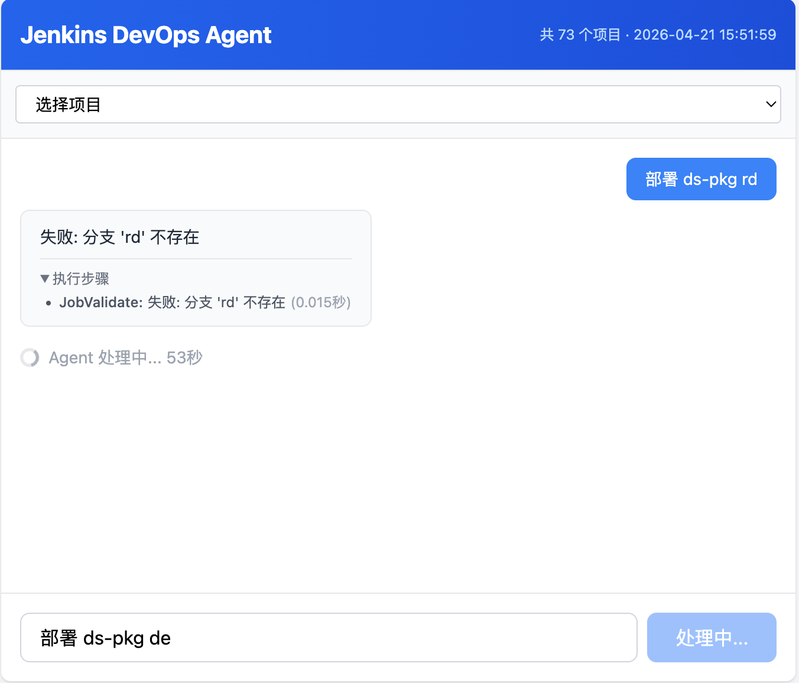
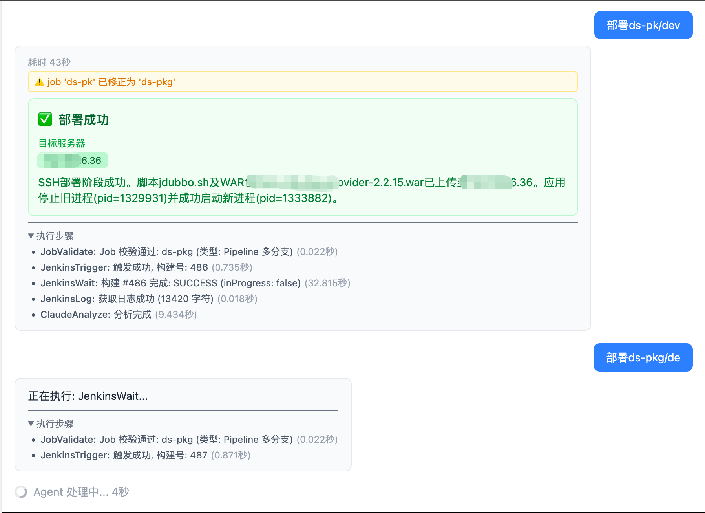

## 架构

### 后端模块

```
backend/src/
├── main.rs                    # Axum Web 服务入口
├── lib.rs                     # 库入口
├── config.rs                  # 配置管理（含 PgConfig、AuthConfig）
├── api.rs                     # HTTP 接口层（路由 + auth_guard layer + knowledge/learn 端点）
│
├── auth/                      # 认证模块（新增）
│   ├── mod.rs
│   ├── jwt.rs                 # JWT 签发验证
│   ├── gitlab_oauth.rs        # GitLab OAuth 登录流程
│   └── middleware.rs          # Axum 认证中间件
│
├── db/                        # 数据库模块（新增）
│   ├── mod.rs
│   ├── pool.rs                # PostgreSQL 连接池
│   └── migrate.rs             # 自动迁移（用户/权限/知识库/统计表）
│
├── permissions/               # 权限模块（新增）
│   ├── mod.rs
│   ├── config.rs              # 从 TOML 加载项目白名单
│   └── checker.rs             # 权限校验器
│
├── knowledge/                 # 知识库模块（两层检索 + 用户反馈驱动）
│   ├── mod.rs
│   ├── fingerprint.rs         # 错误特征码提取（regex 归一化 + SHA256）
│   ├── embedding.rs           # 远程 Embedding API 调用（DashScope，逗号分隔输出）
│   ├── store.rs               # PostgreSQL 存储（pg-vec cosine distance + $1::vector 显式 cast）
│   ├── retriever.rs           # 两层检索器（指纹精确 → Embedding 语义，300ms 超时，Arc<Client>）
│   └── learner.rs             # 知识写入（用户反馈驱动，点赞入库，Arc<Client>）
│
├── harness/                   # 编排框架
│   ├── mod.rs
│   ├── hook.rs                # Hook trait + 钩子点枚举
│   ├── orchestrator.rs        # 步骤链编排器
│   ├── session.rs             # 会话生命周期
│   ├── token_hook.rs          # Token 预算追踪 Hook
│   └── memory_hook.rs         # 记忆保存 Hook
│
├── memory/                    # 记忆系统
│   ├── mod.rs                 # MemoryEntry + MemoryType
│   ├── short_term.rs          # 环形缓冲区，200 条
│   ├── long_term.rs           # SQLite 持久化 + 关键词索引
│   └── store.rs               # SQLite 初始化 + 迁移
│
├── token/                     # Token 管理 + 压缩
│   ├── mod.rs
│   ├── tracker.rs             # 实时计数 + 预算 + 轮次计数
│   ├── window.rs              # 四层上下文（System/Compressed/Structured/Linear）+ 混合 Token 估算
│   └── summarizer.rs          # 混合触发压缩（轮次本地快压 + Token 阈值 LLM 深压）
│
├── security/                  # 权限控制
│   ├── mod.rs
│   ├── roles.rs               # 角色 + 工具请求模型
│   ├── policy.rs              # 策略引擎：ALLOW/DENY/PROMPT
│   └── audit.rs               # 操作审计日志
│
├── sandbox/                   # 沙箱隔离（多后端可切换架构）
│   ├── mod.rs
│   ├── trait_sandbox.rs       # Sandbox trait + ExecResult 统一接口
│   ├── factory.rs             # SandboxFactory：配置驱动降级 + 异步后端检测
│   │
│   ├── cubesandbox/           # CubeSandbox 后端（E2B 兼容，双平面架构）
│   │   ├── mod.rs
│   │   ├── config.rs          # CubeSandboxConfig：API 地址、模板、envd URL 模板
│   │   ├── client.rs          # ControlPlaneClient（REST 控制平面）+ EnvdClient（Connect RPC 数据平面）
│   │   └── backend.rs         # CubeSandboxBackend：懒初始化 + 持久化 + Sandbox trait 实现
│   │
│   ├── process_backend.rs     # ProcessBackend：本地进程沙箱（最终降级方案）
│   ├── microsandbox_backend.rs # MicrosandboxBackend：基于 microsandbox SDK（仅 Linux）
│   ├── process_sandbox.rs     # 进程限制 + 环境净化（底层实现）
│   ├── path_check.rs          # 路径穿越检测
│   ├── fs_isolation.rs        # 文件系统隔离 + 选择性挂载
│   └── network_whitelist.rs   # 网络白名单
│
├── tools/                     # 工具集
│   ├── mod.rs
│   ├── builtin/               # 内置工具
│   │   ├── mod.rs             # Tool trait（含 definition()方法返回 LLM schema）
│   │   ├── adapter.rs         # 适配器：将 builtin Tool 注册到 ToolUseLoop ToolExecutor
│   │   ├── read.rs            # 安全文件读取
│   │   ├── write.rs           # 文件写入
│   │   ├── bash.rs            # 命令执行（白名单校验）
│   │   ├── git.rs             # git 操作
│   │   └── helpers.rs         # 辅助工具（get_time/get_env/get_config，会话级缓存 + TTL）
│   ├── jenkins.rs             # Jenkins API 封装
│   ├── jenkins_cache.rs       # 构建缓存
│   └── gitlab.rs              # GitLab API 封装
│
├── llm/                       # LLM 提供商抽象 + Prompt 构建 + ToolUseLoop
│   ├── mod.rs                 # LlmProvider trait + Message/ChatRequest 等类型
│   ├── router.rs              # ModelRouter：L1/L2 任务分类 + provider 路由
│   ├── structured_output.rs   # Schema 强约束输出
│   ├── prompt_builder.rs      # 七层 Prompt 构建器（静态前缀全局单例 + build_simple 简易模式）
│   │   ├── StaticPrefix       # 层 1~3 全局单例（OnceLock<Arc>，所有请求共享）
│   │   ├── SessionSlots       # 层 5 结构化槽位（目标 + 步骤 + 错误）
│   │   └── MemorySlot         # 层 4 高分记忆过滤注入
│   ├── tool_use_loop/         # LLM ↔ 工具调用闭环（拆分后 8 子模块）
│   │   ├── mod.rs             # ToolUseLoop 核心循环 + ToolCallResult/ToolUseResult
│   │   ├── executor.rs        # ToolExecutor：注册、分派、批量执行、并行安全分级
│   │   ├── retry.rs           # ToolErrorKind + RetryPolicy（指数退避）
│   │   ├── loop_detector.rs   # 死循环检测器（滑动窗口 + 签名匹配）
│   │   ├── signal_voter.rs    # 信号投票器（负面信号收集 + 升级判断）
│   │   ├── tool_registry.rs   # 工具注册表（精确/同义词/子串搜索 + 分类召回）
│   │   ├── fallback.rs        # 降级处理器（交接 Claude Code CLI）
│   │   └── dag.rs             # DAG 编排器（拓扑排序 + 层级并行）
│   └── provider/              # Provider 实现（适配器模式）
│       ├── mod.rs
│       ├── base.rs            # BaseConfig + ProviderAdapter trait + GenericProvider<T>（Arc<BaseConfig>零 clone）
│       ├── config.rs          # ProviderConfig + LlmConfigStore（router 缓存）+ build_model_router()
│       ├── client.rs          # 共享 HTTP 调用逻辑（成功路径丢弃 raw body）
│       ├── openai.rs          # OpenAIAdapter + OpenAIProvider 封装
│       ├── openai_compat.rs   # macro 生成 NVIDIA/DeepSeek/LLaMA/VLLM 适配（OpenAI 兼容协议）
│       └── anthropic.rs       # AnthropicAdapter + AnthropicProvider 封装
│
├── agent/                     # 意图识别 + 步骤编排
│   ├── mod.rs                 # Agent 入口
│   ├── intent.rs              # 意图数据结构
│   ├── router.rs              # 意图路由
│   ├── chain_mapping.rs       # 意图 → 步骤链映射（General 意图按 A/B 比例分流到 ToolUseLoop 或 ClaudeCode）
│   ├── step.rs                # Step trait + StepChain 执行器
│   ├── claude.rs              # Claude 交互 Step
│   └── steps/                 # 业务 Step
│       ├── mod.rs
│       ├── job_validate.rs    # Job 参数校验
│       ├── jenkins_trigger.rs # 触发构建
│       ├── jenkins_wait.rs    # 等待构建完成
│       ├── jenkins_status.rs  # 查询构建状态
│       ├── jenkins_log.rs     # 拉取构建日志
│       ├── build_analysis.rs  # AI 分析构建结果（走 PromptBuilder::build_simple 注入静态前缀）
│       ├── claude_code.rs     # Claude 代码生成（降级方案）
│       └── tool_use_loop.rs   # ToolUseLoopStep：LLM 原生工具调用循环（前端展示为 Agent）
│
└── frontend/                  # Vue 3.5 + Vue Router + TS + Vite 8 + Tailwind CSS 4 前端
    ├── router/                # Vue Router（/chat /dashboard /login）
    ├── views/                 # 页面视图（ChatView/DashboardView/LoginView）
    ├── api/                   # API 模块（client 可选认证 + auth/knowledge/stats）
    └── components/            # 组件（ChatMessage/FeedbackBar/StructuredResponse）
```

### 知识闭环

```
Flow A: 知识命中（已有条目）
  构建日志 → KnowledgeRetriever.search() → 命中 → 返回 solution + entry_id
  → 前端 FeedbackBar → 用户 👍 → /api/knowledge/feedback → confidence += 0.2

Flow B: 知识自增长（LLM 方案入库）
  构建日志 → KnowledgeRetriever.search() → 未命中 → LLM 分析
  → 前端 FeedbackBar（所有回复展示） → 用户 👍 → /api/knowledge/learn → 写入知识库
```

### 认证模式

```
受保护路由 → auth_guard middleware（双模式）：
  1. Authorization: Bearer <JWT> → 用户级权限
  2. X-API-Key → 管理员权限（向后兼容）
  3. 未配置 api_key → 放行（内部部署模式）
```

### 模块关系

```
用户请求
  └── api.rs (HTTP 路由层)
        ├── auth/ → GitLab OAuth 登录 → JWT 签发
        ├── permissions/ → 项目白名单校验
        ├── db/ → PostgreSQL 连接池 + 自动迁移
        │
        └── process_request_with_store()
              ├── Provider Config → build_model_router() → ModelRouter
              │     ├── BaseConfig + ProviderAdapter trait + GenericProvider<T>
              │     ├── OpenAIProvider (GenericProvider<OpenAIAdapter>)
              │     ├── AnthropicProvider (GenericProvider<AnthropicAdapter>)
              │     └── OpenAI 兼容宏生成：NVIDIA/DeepSeek/LLaMA/VLLM Provider
              │
              ├── IntentRouter → 意图识别
              │     ├── 正则匹配（精确指令）
              │     ├── LLM 结构化输出（自然语言）
              │     ├── Jenkins 缓存（Job/分支模糊匹配 + Levenshtein 修正）
              │     └── Correction 记录（job/branch 修正提示，前端展示）
              │
              ├── StepChain → 步骤编排执行（支持 SSE 流式推送）
              │     ├── JobValidate → JenkinsTrigger → JenkinsWait
              │     └── JenkinsLog → BuildAnalysis / Agent
              │
              ├── Agent(ToolUseLoopStep) → LLM 原生工具调用循环
              │     ├── ToolExecutor：注册 get_time/get_env/get_config 等内置工具
              │     ├── 循环：LLM 返回 tool_calls → 执行工具 → 结果注入 → 再次调用
              │     └── 降级：无 LLM Provider 时回退到 ClaudeCodeStep → Claude Code CLI
              │
              └── Harness Orchestrator → 编排核心
                    ├── Hook: Token (Token 预算追踪)
                    ├── Hook: Memory (记忆保存)
                    ├── SandboxFactory → 配置驱动后端选择
                    │     ├── CubeSandbox（REST 控制平面 + Connect RPC 数据平面，懒初始化）
                    │     ├── Microsandbox（microsandbox SDK，仅 Linux KVM）
                    │     └── Process（本地进程沙箱，最终降级）
                    └── Tools (工具集)
```

### Token 渐进式压缩

```
触发策略（混合触发）:
  - 轮次到达阈值(10) → 本地快速压缩（句子边界截断）
  - Token 使用率>80% → LLM 深度压缩
  - Token 估算: 中文 ~1.5/字, ASCII ~4 char/token

压缩产物处理:
  - 被压缩的 Linear 消息删除
  - 摘要追加到 Compressed 层尾部（后续请求可缓存）

阶段 1 (轮次 1~10):  线性保留，零开销
阶段 2 (轮次 11~15): 本地摘要旧数据，保留最近 5 轮线性
阶段 3 (轮次 16+):   结构化文档 + 最近 5 轮线性
                     Token 快满时升级为 LLM 深度压缩
```

### Prompt 构建架构（七层前缀缓存最大化）

```
层 1 [100% 缓存]  静态 System 核心（角色/行为准则/安全红线）
层 2 [100% 缓存]  静态工具定义（核心工具 + get_time/get_env/get_config）
层 3 [高缓存]     半静态规则（项目 CLAUDE.md / 通用规则）
层 4 [部分缓存]   动态记忆（高分记忆注入，低分留 SQLite）
层 5 [低缓存]     Session 上下文（结构化槽位：目标 + 步骤 + 错误）
层 6 [低缓存]     动态工具（Jenkins/GitLab 场景工具按需追加）
层 7 [0% 缓存]    对话 Messages（智能分层裁剪）

辅助工具缓存:
  - get_time: TTL 1 分钟
  - get_env/get_config: TTL 10 分钟
  - 环境变量/配置路径白名单校验
```
## Agent Loop
```
Agent 执行流程（精简版）：

1. 接收用户输入 → 构建 Prompt → 调用 LLM
2. 解析 LLM 返回：
   - 工具调用 → 权限检查 → 执行工具 → 结果注入上下文 → 回到步骤 1
   - 纯文本 → 返回给用户，结束本轮
3. 安全约束：
   - 授权：PolicyEngine 校验工具调用权限
   - 重试：最大重试次数限制（防止死循环）
   - 降级：LLM 不可用时返回降级响应

参考实现：
- backend/tests/agent_simple_test.rs — run_openai_agent() / run_claude_agent()
- Phase 4 集成计划：TokenHook + MemoryHook 串联完整流程
```
## 部署、测试
```
# 重启前后端
# 端口默认 后端8080 前端3000，可在 config.toml 配置
./scripts/run.sh

# 1. 启动 Rust 后端
cd backend
./run-signed.sh

cargo test 需忽略 ignore

# 2. 启动前端（另一个终端）
cd frontend
bun install
bun run dev

# 3. 访问 http://localhost:3000

```


## 效果图

